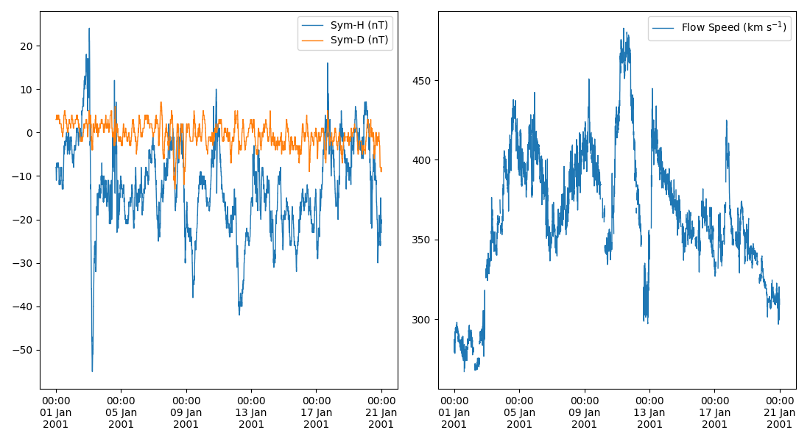

# pyomnidata
Python tool for downloading, converting and reading OMNI solar wind data.

If you make use of the OMNI data please acknowledge and cite as specified here: https://omniweb.gsfc.nasa.gov/html/citing.html

## Installation

Simply install using `pip3`:

```bash
pip3 install pyomnidata --user
```

Alternatively install from this repository:

```bash
git clone https://github.com/mattkjames7/pyomnidata
cd pyomnidata

#EITHER build a wheel and install with pip (better)
python3 setup.py bdist_wheel
pip3 install dist/pyomnidata-1.0.0-py3-none-any.whl --user

#OR directly using setup py (should work, not tested though)
python3 setup.py install --user
```

For this to work properly - you will need to set up the `$OMNIDATA_PATH` environment variable to point to a folder where you want to store the data. Do this by adding something along the lines of the following to the bottom of your `~/.bashrc` file:

```bash
export OMNIDATA_PATH=/path/to/omni/data
```


## Usage

### Downloading Data

Download OMNI data like this:

```python
import pyomnidata

#download all available data
pyomnidata.UpdateLocalData()
```

Download F10.7 index (solar flux at 10.7 cm):

```python
pyomnidata.UpdateSolarFlux(EndDate=2021024)
```

where `EndDate` is the last date which you want to request solar flux data for. This should be set to something at least a few days prior to the current date, if you request a date which currently has no available data then the download will fail.

### Read Data

Get the OMNI parameters like so:

```python
####OMNI parameters####
#Year can either be a single year:
Year = 2001
#or it can be a range:
Year = [2001,2004]

#5 minute resolution data
data = pyomnidata.GetOMNI(Year,Res=5)

#1 minute data
data = pyomnidata.GetOMNI(Year,Res=1)

####solar flux###
#all of the data
data = pyomnidata.GetSolarFlux()

#a single date
data = pyomnidata.GetSolarFlux(Date=20050101)

#a range of dates
data = pyomnidata.GetSolarFlux(Date=[20020101,20020103])
```

The returned `data` object is a `numpy.recarray` object which contains all of the OMNI data requested. To see what fields are stored use `print(data.dtype.names)`. The units are as presented here: https://omniweb.gsfc.nasa.gov/html/omni_min_data.html#4b

### Plot Data

Use the `PlotOMNI` function, e.g.:

```python
import matplotlib.pyplot as plt

#create a figure
plt.figure(figsize=(11,6))

#plot some stuff in one panel
ax0 = pyomnidata.PlotOMNI(['SymH','SymD'],[20010101,20010120],fig=plt,maps=[2,1,0,0])

#and a second panel
ax1 = pyomnidata.PlotOMNI(['FlowSpeed'],[20010101,20010120],fig=plt,maps=[2,1,1,0])

#fit things a bit nicer
plt.tight_layout()
```

Which should produce something like the following:



